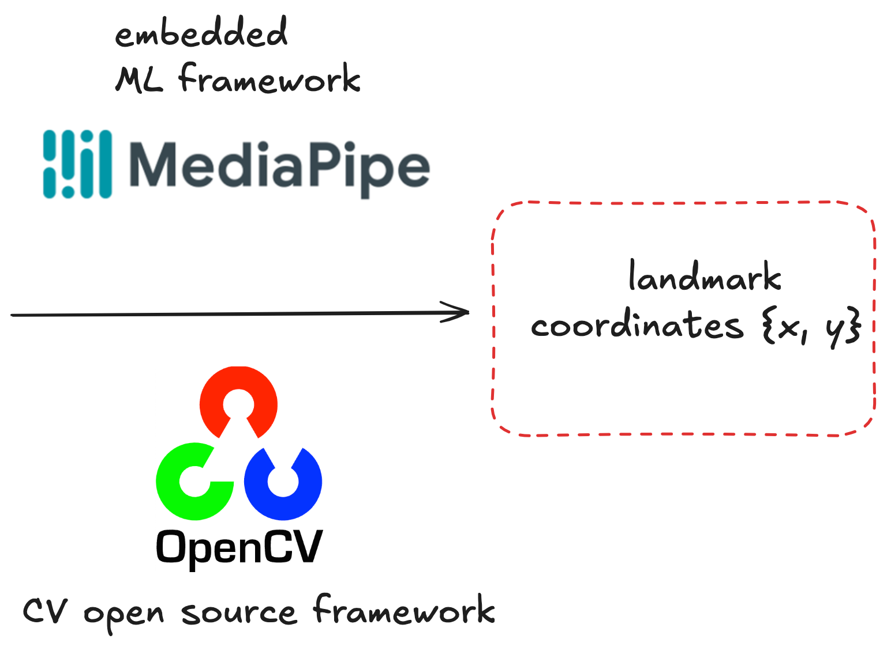
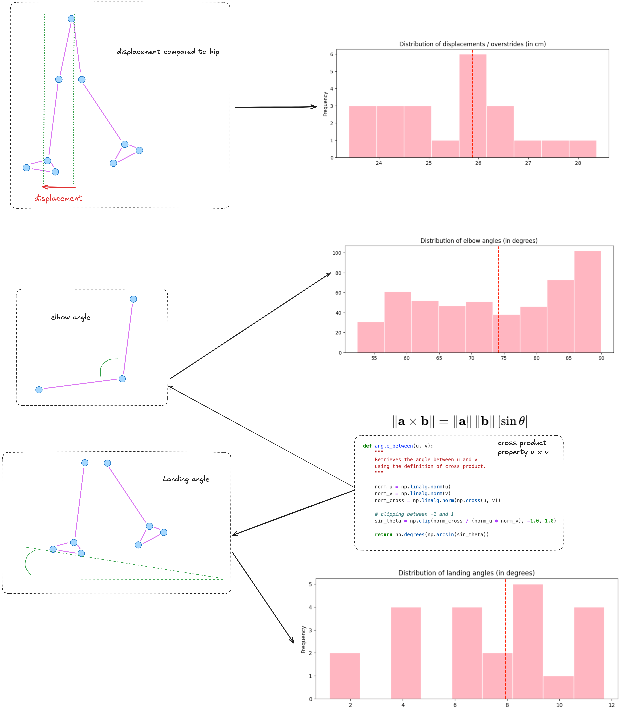

# Running Pose Estimation project 📈

Python project using **Computer Vision** and **Pose Estimation** from **OpenCV** and **MediaPipe**. The aim of the project is to **provide insights** and **improve running stride** using a video as input.

    

    

### Notes on the Approach

1. **Warm-up and Video Preparation**  
   - Ensure a proper warm-up before recording to achieve optimal results.  
   - Exclude the initial portion of the video to avoid inaccuracies caused by suboptimal motion.  

2. **Viewpoint Considerations** *(To-Do for 3D Insights)*  
   - A frontal view is necessary for detailed 3D analysis, allowing evaluation of:  
     - **Symmetry**: Assess symmetry with respect to the central axis.  
     - **Oscillations**: Detect and measure any undesired body oscillations.  
     - **Elbow and Shoulder Positions**: Monitor alignment and movement for stability.  

3. **Metrics Evaluated**  
   - **Elbow Angle**: Measure the angle at the elbow during movement.  
   - **Heel Strike**: Identify the angle at which the foot makes contact with the ground.  
   - **Overstriding**: Ensure the center of the foot lands below the body's center of projection to avoid inefficiencies.  
